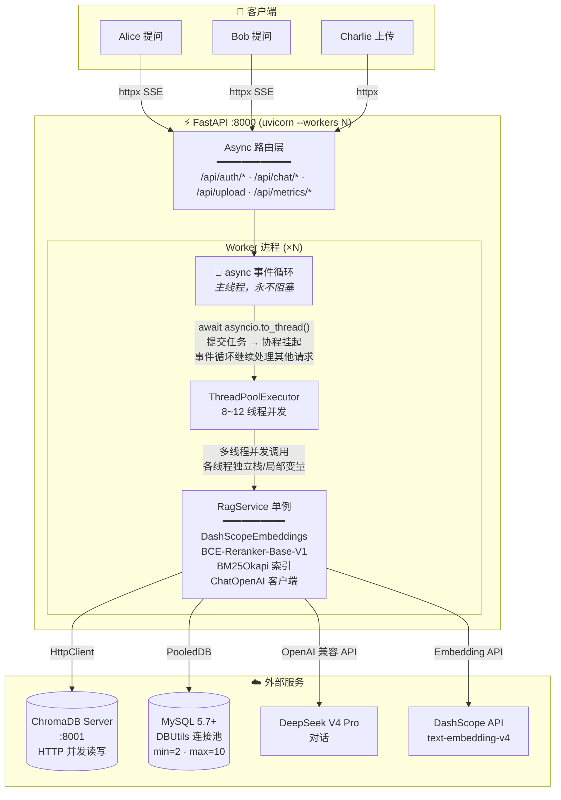
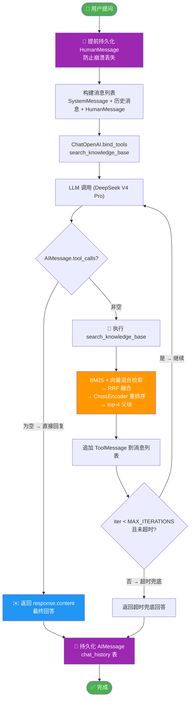
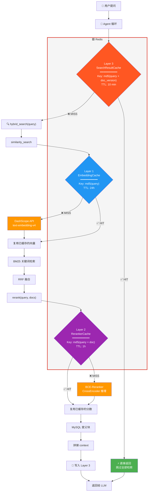

# RAG 智能助手 <sup>v2.8.0</sup>

基于 FastAPI + LangChain + Streamlit 的 RAG 高并发问答系统，支持文件上传、向量检索、对话记忆和上下文管理。

## 功能

- **用户注册/登录** — JWT 认证 + bcrypt 密码哈希
- **文件上传入库** — 文本/Markdown 文件自动分段 → 向量化 → ChromaDB，支持 MD5 去重，父子块分层存储
- **Agent 智能问答** — ReAct 范式，LLM 自主决定是否检索、检索什么、检索几次，BM25 + 向量混合检索 + CrossEncoder 重排序
- **滑动窗口上下文** — 保留最近 30 条消息（≈15 轮对话），扩大窗口避免上下文丢失
- **历史会话记录** — 侧边栏查看最近 10 轮对话，从 MySQL 持久化读取，跨会话保留
- **性能监控仪表盘** — 延迟分布、Token 趋势、工具调用统计、缓存命中率，结构化 metrics 持久化到 MySQL
- **高并发架构** — FastAPI async 路由 + 线程池执行同步逻辑 + ChromaDB Server + MySQL 连接池
- **SSE 流式返回** — Agent 问答通过 Server-Sent Events 实时推送，用户无需等待完整响应
- **多会话管理** — 同一用户可创建多个独立会话（`username_uuid`），多端互不干扰

## 技术栈

| 组件 | 技术 |
|------|------|
| 后端 | FastAPI (async) + uvicorn |
| 前端 | Streamlit（纯 UI 层，通过 httpx 调 API） |
| LLM | DeepSeek V4 Pro（对话，OpenAI 兼容 API） |
| Embedding | DashScope text-embedding-v4 |
| 向量库 | ChromaDB（Client/Server 模式，独立进程） |
| 数据库 | MySQL 5.7+（DBUtils 连接池） |
| 缓存 | Redis 6.0+（三层缓存：Embedding / 检索结果 / Reranker） |
| 检索 | BM25（jieba）+ ChromaDB 向量 → RRF 融合 |
| 重排序 | BCE-Reranker-Base-V1（本地部署） |
| 认证 | JWT (HS256) + bcrypt |
| Agent 框架 | 原生 Function Calling（`ChatOpenAI.bind_tools()` + 自写 Agent 循环） |

## 项目结构

```
rag_project/
├── api/                        # FastAPI 后端（v2.7.0 新增）
│   ├── main.py                 # FastAPI app + lifespan + CORS
│   ├── deps.py                 # 依赖注入（JWT 鉴权、RagService 注入）
│   ├── schemas.py              # Pydantic 请求/响应模型
│   └── routes/
│       ├── auth.py             # POST /api/auth/login, /api/auth/register
│       ├── chat.py             # POST /api/chat/send (SSE), GET history, DELETE clear
│       ├── upload.py           # POST /api/upload
│       └── metrics.py          # GET /api/metrics/summary, /api/metrics/recent
├── app/
│   ├── login_page.py           # 入口：登录 / 注册（调 FastAPI）
│   └── pages/
│       ├── chat_page.py        # 智能助手问答页（httpx SSE 流式调用）
│       ├── upload_page.py      # 文件上传页（httpx 调 FastAPI）
│       └── metrics_page.py     # 性能监控仪表盘（httpx 调 FastAPI）
├── core/
│   ├── config.py               # 全局配置（环境变量 + 常量）
│   ├── database.py             # MySQL 连接池 + 自动建库建表
│   ├── auth.py                 # JWT 签发/解码 + bcrypt 密码管理
│   ├── rag.py                  # RagService 单例 + Agent 循环
│   ├── ingestion.py            # IngestionService 单例 + 父子块切分
│   ├── metrics.py              # 性能指标存取（MySQL 持久化 + 聚合查询）
│   ├── cache.py                 # Redis 缓存层（Embedding / 检索结果 / Reranker 三层缓存）
│   ├── logging_config.py       # 统一日志配置（RotatingFileHandler + 分级输出）
│   └── vector_store.py         # ChromaDB (HttpClient) + BM25 + Reranker
├── storage/
│   └── chat_history.py         # MySQL 对话历史持久化（滑动窗口）
├── logs/                       # 应用日志（app.log / error.log / debug.log，自动轮转）
├── data/
│   ├── chroma_db/              # ChromaDB 持久化目录（由 chroma server 管理）
│   ├── bm25_index.pkl          # BM25 索引磁盘缓存
│   ├── models/                 # 本地模型（BCE-Reranker-Base-V1）
│   ├── uploads/                # 用户上传的原始文件
│   └── md5.text                # 文件去重 MD5 记录
└── .env                        # 环境变量（API Key、数据库连接等）
```

## 并发架构（v2.7.0）



  多用户请求通过 httpx 打到 FastAPI。async 路由不阻塞事件循环，通过 `asyncio.to_thread` 将同步的 RagService 调用丢入线程池执行，同时主线程还可执行事件循环，接收其他的http请求。

  每个 worker 进程内 RagService 是全局单例（`threading.Lock` 双重检查），所有请求共享同一套 embedding / reranker / BM25 索引 / LLM 客户端。ChromaDB 作为独立进程运行（`:8001`），HTTP 接口天然支持并发读写。MySQL 通过 `DBUtils.PooledDB` 连接池复用连接。

  **这里提出一个问题，项目的RagService是全局单例，假如我fastapi只开一个worker进程，那如果有多 用户同时聊天调用了ragservice，会阻塞吗？**

答：不会阻塞。注意区别单例和线程池，多个用户同时发请求时，各自的 rag.invoke() 会在线程池的不同线程中并发执行。

  具体原理：

  1. 事件循环（主线程）不会卡住：await asyncio.to_thread(rag.invoke, ...) 只是把rag.invoke 这个同步任务提交ThreadPoolExecutor
        的队列里，然后当前协程挂起，事件循环立刻回头去处理其他请求（比如用户 B的请求）。
  2. 线程池允许多线程并发：Python 默认线程池大小为 min(32, cpu_count + 4)，通常8~12 个线程。每个 rag.invoke()
      跑在独立线程上，各有自己的调用栈和局部变量，互不阻塞。
    3. 单例 RagService 只是个容器对象，多线程同时调用它没有问题，关键在于它内部各组件是否线程安全：

  简单说：单 worker 进程下，事件循环负责快速调度，线程池负责并发执行同步的 RAG调用。只要并发用户数不超过线程池大小（默认
  8~12），所有用户都能同时得到服务；超过后排队等待，但事件循环本身始终不会阻塞。

| 组件 | 旧架构问题 | v2.7.0 方案 |
|------|-----------|------------|
| **请求处理** | Streamlit 单进程，阻塞式 | FastAPI async 路由，`asyncio.to_thread` 线程池 |
| **RagService** | 每用户创建实例，内存爆炸 | 全局单例，每 worker 进程仅一份 |
| **ChromaDB** | 嵌入式 SQLite，并发写 `database is locked` | **Client/Server 模式，独立进程，主服务线程池每个线程会发起独立 HTTP 请求** |
| **BM25 索引** | 多实例同时写 pickle 文件，竞态损坏 | `threading.Lock` 保护重建路径 |
| **MySQL** | 每次请求新建连接 | **`DBUtils.PooledDB` 连接池，每次 get_connection() 从池里拿独立连接** |
| **会话隔离** | `session_id = username`，同用户串消息 | `username_uuid` 独立会话 |


## 数据库设计

### users
| 字段 | 类型 | 说明 |
|------|------|------|
| id | INT PK | 用户 ID |
| username | VARCHAR(64) UNIQUE | 用户名 |
| password | VARCHAR(256) | bcrypt 哈希 |
| created_at | DATETIME | 注册时间 |

### chat_history
| 字段 | 类型 | 说明 |
|------|------|------|
| id | BIGINT PK | 消息 ID |
| session_id | VARCHAR(128) INDEX | 会话 ID（`username_uuid`） |
| message | JSON | LangChain 消息格式 |
| created_at | DATETIME | 消息时间 |

### document_parents
| 字段 | 类型 | 说明 |
|------|------|------|
| parent_id | VARCHAR(32) PK | 父块 MD5 标识 |
| parent_content | MEDIUMTEXT | 父块完整内容 |
| parent_title | VARCHAR(500) | 章节标题（Markdown 标题行） |
| source | VARCHAR(255) | 来源文件名 |
| child_count | INT | 该父块包含的子块数 |

### metrics
| 字段 | 类型 | 说明 |
|------|------|------|
| id | BIGINT PK | 指标 ID |
| session_id | VARCHAR(128) INDEX | 会话 ID |
| total_latency_ms | INT | 端到端延迟（ms） |
| retrieval_latency_ms | INT | 检索耗时（ms） |
| llm_latency_ms | INT | LLM 调用耗时（ms） |
| tool_call_count | INT | 工具调用次数 |
| tool_details | JSON | 工具调用详情 |
| input_tokens | INT | 输入 token 数 |
| output_tokens | INT | 输出 token 数 |
| cache_read_tokens | INT | 缓存命中 token 数 |
| reasoning_tokens | INT | 推理 token 数 |

## API 文档

FastAPI 启动后访问 `http://localhost:8000/docs` 查看 Swagger UI。

| 方法 | 路径 | 说明 |
|------|------|------|
| POST | `/api/auth/login` | 登录，返回 JWT token |
| POST | `/api/auth/register` | 注册 |
| POST | `/api/chat/send` | 问答（SSE 流式返回） |
| GET | `/api/chat/history?session_id=xx` | 获取会话历史 |
| DELETE | `/api/chat/clear` | 清空会话 |
| POST | `/api/chat/sessions` | 创建新会话 |
| POST | `/api/upload` | 上传文件到知识库 |
| GET | `/api/metrics/summary?days=7` | 性能指标汇总 |
| GET | `/api/metrics/recent?limit=50` | 最近查询明细 |
| GET | `/api/metrics/cache` | Redis 缓存命中率 |

## 快速开始

### 1. 环境要求

- Python 3.10+
- MySQL 5.7+

### 2. 安装依赖

```bash
pip install -r requirements.txt
```

### 3. 配置 .env

```bash
# Embedding
DASHSCOPE_API_KEY=sk-your-key-here

# 对话模型
DEEPSEEK_API_KEY=sk-your-key-here
DEEPSEEK_BASE_URL=https://api.deepseek.com
DEEPSEEK_CHAT_MODEL=deepseek-v4-pro

# MySQL
MYSQL_HOST=127.0.0.1
MYSQL_PORT=3306
MYSQL_USER=rag_user
MYSQL_PASSWORD=Rag@123456
MYSQL_DATABASE=rag_db

# ChromaDB Server
CHROMA_HOST=127.0.0.1
CHROMA_PORT=8001

# Redis (v2.8.0)
REDIS_HOST=127.0.0.1
REDIS_PORT=6379
REDIS_DB=0
# REDIS_PASSWORD=  # 可选，生产环境建议设置

# JWT
JWT_SECRET_KEY=your-secret-key-change-in-production
JWT_EXPIRE_HOURS=24

# 日志（可选，默认 INFO）
LOG_LEVEL=INFO
```

### 4. 启动

```bash
# 1. 启动 ChromaDB Server（独立进程）
chroma run --path data/chroma_db --port 8001 &

# 2. 确保 Redis 已启动（默认 localhost:6379）
redis-server --daemonize yes

# 3. 启动 FastAPI
uvicorn api.main:app --host 0.0.0.0 --port 8000 --workers 4

# 4. 启动 Streamlit（纯前端 UI）
streamlit run app/login_page.py
```

### 5. 使用流程

1. 打开浏览器访问 `http://localhost:8501`
2. 注册账号 → 登录
3. 进入「文件上传」页面上传文本/Markdown 文件（.txt, .md）
4. 进入「智能助手」页面，基于文档内容提问

## 上下文管理机制

系统使用**滑动窗口**机制管理对话上下文，在窗口容量和内存消耗之间取得平衡。

### 记忆框架架构

LangChain 提供了两类记忆/对话历史方案：

| 方案 | 所属模块 | 适用场景 |
|------|---------|---------|
| `ConversationBufferMemory` / `ConversationBufferWindowMemory` / `ConversationSummaryBufferMemory` | `langchain.memory`（旧版 API） | `LLMChain` / `ConversationChain` 体系 |
| `BaseChatMessageHistory` + `RunnableWithMessageHistory` | `langchain_core`（LCEL 新架构） | `create_react_agent` + `AgentExecutor` 体系 |

本项目采用 **LCEL 新架构**，通过继承 `BaseChatMessageHistory` 自行实现滑动窗口记忆：

```
RunnableWithMessageHistory   ← 框架层：链执行前后自动调用 memory.add_messages / memory.messages
        ↑
BaseChatMessageHistory       ← 抽象接口：add_messages / messages / clear
        ↑
MySQLChatMessageHistory      ← 自定义实现：MySQL 持久化 + 滑动窗口
```

与 LangChain 旧版类的对应关系：

| LangChain 旧版类 | 本项目等价实现 | 机制 |
|-----------------|--------------|------|
| `ConversationBufferMemory` | `MySQLChatMessageHistory.messages`（不加 LIMIT 即为全量） | 存储完整对话历史 |
| `ConversationBufferWindowMemory`（K 轮） | `WINDOW_SIZE = 30`，SQL `LIMIT 30`（约 15 轮） | 只保留最近 K 条消息 |

采用 LCEL 架构的优势：

- **持久化自由** — 旧版 Memory 默认存内存，重启即丢；本项目直接写入 MySQL，跨会话持久化
- **Agent 原生兼容** — 旧版 Memory 对接 `create_react_agent` + `AgentExecutor` 需要额外适配层
- **提前持久化** — 用户消息在 Agent 循环启动前即写入数据库，避免中途崩溃导致问题丢失

### 滑动窗口

`MySQLChatMessageHistory.messages` 只返回最近 `WINDOW_SIZE`（默认 30）条消息，等效于约 15 轮问答。对话超过窗口时，最早的消息自然丢弃，通过扩大窗口（从 v2.7 的 10 条增加到 v2.8 的 30 条）保留更多近期上下文。

> DeepSeek V4 Pro 支持 128K context，30 条消息仅占约 2-3 万 token，远未触及上限。对于本项目的典型使用场景（15 轮以内的问答），直接扩大窗口比摘要压缩更简单可靠。

### Agent 推理流程

系统采用原生 Function Calling，LLM 通过结构化 JSON 决定是否调用工具：



对于简单问候，LLM 自动跳过工具调用直接回复，避免不必要的检索开销。

### 相关配置

```python
# core/config.py
WINDOW_SIZE = 30   # 滑动窗口大小，约 15 轮问答
```

## Redis 缓存架构（v2.8.0）

系统在检索链路的三处关键节点引入 Redis 缓存，减少重复计算和外部 API 调用。

### 分层架构



### 三层缓存详解

| 层级 | 类 | 缓存内容 | Key | TTL | 命中收益 |
|------|-----|---------|------|-----|---------|
| **Layer 1** | `EmbeddingCache` | text → 768-dim 向量 | `rag:emb:{md5(text)}` | 24h | 跳过 DashScope API 调用（~100-300ms） |
| **Layer 2** | `RerankerCache` | (query, doc) → 相关性分数 | `rag:rerank:{md5(query+doc)}` | 1h | 跳过 CrossEncoder 推理（~50-200ms） |
| **Layer 3** | `SearchResultCache` | query → 完整检索上下文 | `rag:search:v{ver}:{md5(q)}` | 10min | 跳过全部三层：embedding + 检索 + rerank |

Layer 1 和 Layer 2 是**确定性缓存**（相同输入永远返回相同结果），不随文档更新而失效。Layer 3 是**版本化缓存**，Key 包含 `doc_version`，确保文档入库后自动失效。

### 文档版本管理

```
文档上传 → bump_doc_version()
              │
              ▼
         Redis INCR rag:doc_version  (1 → 2 → 3 → ...)
              │
              ▼
         所有 SearchResultCache 的旧版本 key 自然失效
         (rag:search:v1:* 不会被查询，因为 get() 取的是当前版本号)
```

- `get_doc_version()` — 读取当前版本号（首次启动自动初始化为 1）
- `bump_doc_version()` — 原子递增（`INCR`），每次文件入库成功后调用
- EmbeddingCache 和 RerankerCache **不受版本号影响**（它们的输出是确定性函数）

### 降级策略

Redis 不可用时（进程未启动、网络不通、OOM），所有缓存自动降级为 no-op，不影响核心问答功能：

```python
# core/cache.py 关键保护机制
def _redis_ok() -> bool:
    """连接失败 → 所有 cache.enabled = False → 走原始路径"""
    try:
        return get_redis_client().ping()
    except Exception:
        return False

def _safe_redis(callable, default=None):
    """单次操作异常 → 静默返回 default，不影响上层逻辑"""
    try:
        return callable()
    except Exception:
        logger.debug("Redis 操作异常（已降级）", exc_info=True)
        return default
```

### 监控

`GET /api/metrics/cache` 返回各层命中率：

```json
{
  "doc_version": 3,
  "embedding": {"hits": 150, "misses": 30, "hit_rate": 0.8333},
  "search":    {"hits": 40,  "misses": 20, "hit_rate": 0.6667},
  "rerank":    {"hits": 80,  "misses": 40, "hit_rate": 0.6667}
}
```

### 相关配置

```python
# core/config.py — Redis 连接
REDIS_HOST = "127.0.0.1"
REDIS_PORT = 6379
REDIS_DB = 0
REDIS_SOCKET_TIMEOUT = 2.0

# 各层开关和 TTL（均可通过环境变量覆盖）
EMBEDDING_CACHE_ENABLED = True    # EMBEDDING_CACHE_ENABLED=false 关闭
EMBEDDING_CACHE_TTL = 86400       # EMBEDDING_CACHE_TTL=86400
SEARCH_CACHE_ENABLED = True
SEARCH_CACHE_TTL = 600
RERANKER_CACHE_ENABLED = True
RERANKER_CACHE_TTL = 3600
```

## 文档分块策略（v2.1.0）

系统采用 **父子块（Parent-Child）分层策略**：

- **父块切分**：优先按 Markdown 标题（`#` ~ `######`）识别章节边界；无标题时按段落空行切分；超长段落按句子边界强制截断。父块目标大小 ≤ 4000 字符，存入 MySQL `document_parents` 表。
- **子块切分**：在每个父块内部按句子边界切分为 300 字符的小块，存入 ChromaDB 用于向量检索。
- **检索流程（v2.2.0）**：query → 向量路（top-8）+ BM25 路（top-8）→ RRF 融合 → 按父块去重 → CrossEncoder 重排序 → 取 top-4 父块 → MySQL 查完整父块内容 → 拼入 LLM prompt。


## 配置参考

| 配置项 | 默认值 | 说明 |
|--------|--------|------|
| `DEEPSEEK_CHAT_MODEL` | `deepseek-v4-pro` | 对话模型 |
| `DEEPSEEK_BASE_URL` | `https://api.deepseek.com` | DeepSeek API 地址 |
| `MAX_ITERATIONS` | `8` | Agent 最大工具调用轮数 |
| `MAX_EXECUTION_TIME` | `120` | Agent 最大执行时间（秒） |
| `WINDOW_SIZE` | `30` | 滑动窗口消息条数（约 15 轮对话） |
| `PARENT_MAX_SIZE` | `4000` | 父块目标大小上限（字符） |
| `CHILD_CHUNK_SIZE` | `300` | 子块大小（用于向量检索） |
| `CHILD_CHUNK_OVERLAP` | `50` | 子块重叠量 |
| `TOP_K_CHILDREN` | `8` | 向量检索子块数 |
| `TOP_K_BM25` | `8` | BM25 检索子块数 |
| `TOP_K_PARENTS` | `4` | 最终返回父块给 LLM 的数量 |
| `RRF_K` | `60` | RRF 融合常数 |
| `RERANKER_MODEL` | `data/models/bce-reranker-base_v1` | 本地重排序模型路径 |
| `BM25_INDEX_PATH` | `data/bm25_index.pkl` | BM25 磁盘缓存路径 |
| `COLLECTION_NAME` | `rag` | ChromaDB 集合名 |
| `CHROMA_HOST` | `127.0.0.1` | ChromaDB Server 地址 |
| `CHROMA_PORT` | `8001` | ChromaDB Server 端口 |
| `MYSQL_POOL_MIN` | `2` | 连接池最小连接数 |
| `MYSQL_POOL_MAX` | `10` | 连接池最大连接数 |
| `REDIS_HOST` | `127.0.0.1` | Redis 地址 |
| `REDIS_PORT` | `6379` | Redis 端口 |
| `REDIS_DB` | `0` | Redis 数据库编号 |
| `REDIS_SOCKET_TIMEOUT` | `2.0` | Redis 操作超时（秒） |
| `EMBEDDING_CACHE_ENABLED` | `true` | 启用 Embedding 缓存 |
| `EMBEDDING_CACHE_TTL` | `86400` | Embedding 缓存过期时间（秒，默认 24h） |
| `SEARCH_CACHE_ENABLED` | `true` | 启用检索结果缓存 |
| `SEARCH_CACHE_TTL` | `600` | 检索结果缓存过期时间（秒，默认 10min） |
| `RERANKER_CACHE_ENABLED` | `true` | 启用 Reranker 缓存 |
| `RERANKER_CACHE_TTL` | `3600` | Reranker 缓存过期时间（秒，默认 1h） |
| `JWT_EXPIRE_HOURS` | `24` | Token 过期时间 |
| `LOG_LEVEL` | `INFO` | 日志级别（DEBUG / INFO / WARNING / ERROR） |

## 日志系统

所有日志统一输出到 `logs/` 目录，通过 Python `logging` 模块 + `RotatingFileHandler` 管理。单文件上限 **10 MB**，保留 **5** 个滚动备份，不会无限增长。

### 日志目录

```
logs/
├── app.log        # INFO 及以上 — 正常运维日志
├── error.log      # WARNING 及以上 — 告警和错误（排查问题第一时间看这里）
├── debug.log      # DEBUG 及以上 — 全量调试日志（仅 LOG_LEVEL=DEBUG 时详细）
└── llm_trace.log  # LLM 请求/响应原始 JSON — 每轮迭代的完整收发记录
```

### 各级别记录内容

| 级别 | 输出文件 | 记录内容 |
|------|---------|---------|
| **DEBUG** | `debug.log` | 每轮 LLM 迭代的 finish_reason、tool_calls、本轮 token 用量（input/output/cache_read/reasoning）；向量检索 / BM25 命中 / RRF 融合的中间结果；BM25 缓存命中判断；数据库连接池状态 |
| **INFO** | `app.log` | 服务启动/关闭；每次 invoke 汇总（session、耗时、总 token、工具调用次数）；文档入库成功（文件、父块数、子块数）；上传请求；会话创建；BM25 索引重建 |
| **WARNING** | `error.log` | Agent 超时；检索无结果；metrics 写入 MySQL 失败；BM25 磁盘缓存加载失败（自动降级）；文件编码不支持 |
| **ERROR** | `error.log` | 未捕获异常（`exc_info=True` 附完整堆栈）；数据库初始化失败；问答流程异常；文件入库失败 |

### LLM 追踪日志

`logs/llm_trace.log` 独立于日志级别，**始终记录**每次 LLM 调用的完整请求和响应 JSON：

```
══════ iter0 REQUEST session=wql_abc12345 ══════
[
  {
    "type": "system",
    "content": "你是一个智能对话助手。..."
  },
  {
    "type": "human",
    "content": "Python 有哪些分支结构？"
  }
]
══════ iter0 RESPONSE session=wql_abc12345 (2.3s) ══════
{
  "type": "ai",
  "content": "",
  "tool_calls": [
    {
      "name": "search_knowledge_base",
      "args": {"query": "Python 分支结构"},
      "id": "call_xxx"
    }
  ],
  "usage_metadata": {
    "input_tokens": 520,
    "output_tokens": 45,
    "input_token_details": {"cache_read": 480},
    "output_token_details": {"reasoning": 0}
  }
}
```

每一轮 Agent 迭代对应一对 `REQUEST` / `RESPONSE`。REQUEST 是发给 LLM 的完整消息列表（包括 system prompt、历史消息、工具返回结果），RESPONSE 是 LLM 返回的原始结构化 JSON。排查工具调用参数错误、prompt 异常、token 用量异常时直接看这个文件。

### 调试模式

```bash
# 设置环境变量即可，无需改代码
export LOG_LEVEL=DEBUG
```

设为 `DEBUG` 后，每轮 Agent 迭代会记录完整的 LLM 响应元数据和 token 用量明细，方便排查工具调用问题。生产环境保持默认 `INFO` 即可。

### 与 metrics 的关系

日志和 MySQL metrics **互补但不重复**：

- **`logs/app.log`** — 人类可读的摘要，排查问题时快速扫一眼，看哪个请求慢了、哪个报错了
- **MySQL `metrics` 表** — 结构化数据，供 Streamlit 仪表盘画图（延迟分布、Token 趋势、缓存命中率）
- **`logs/debug.log`** — 单次请求的每一步中间状态，开发/调试时用

三者记录同一批指标（耗时、token、工具调用），但用途不同：日志用于定位问题，metrics 用于量化分析。

